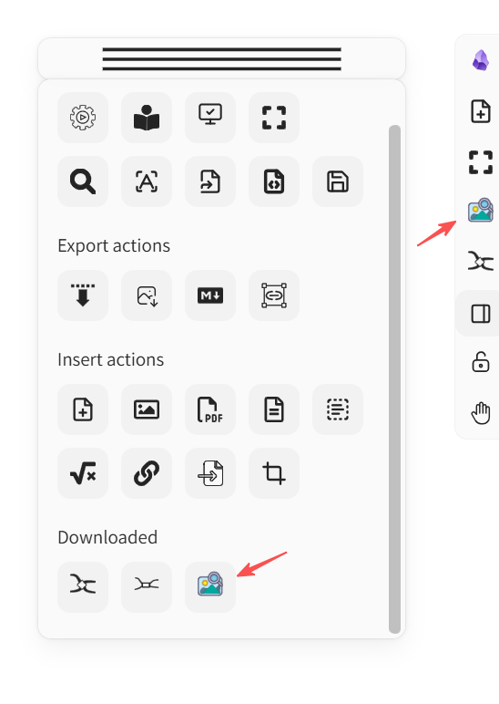
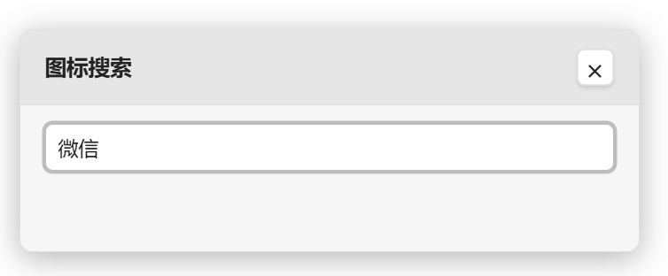
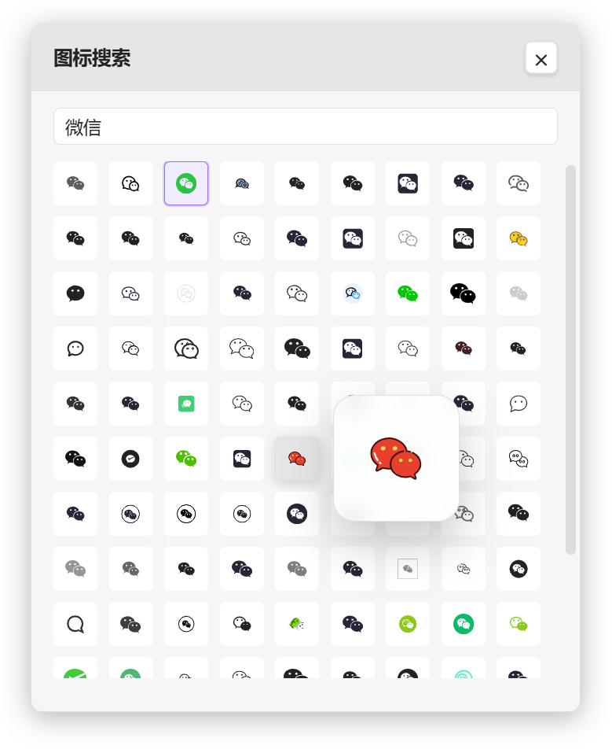
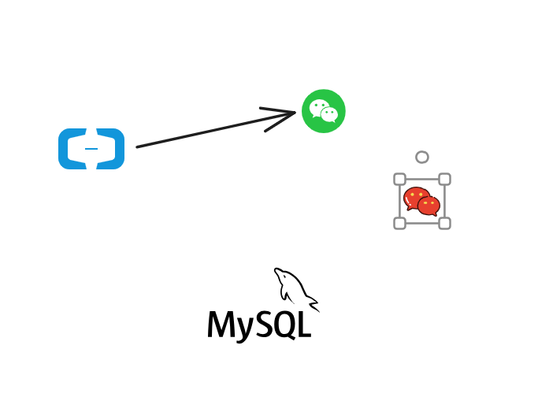

# Obsidian Excalidraw Icon Search

中文 | [English](README_en.md)

一个面向 Obsidian Excalidraw 的图标快速搜索与插入脚本。

笔者之前是从语雀换成obsidian的，之前在语雀经常使用画板中的iconfront svg 图标搜索插件，非常快捷好用，切换到excalidraw之后画图出入图标不能搜索，素材有限，为了解决这个问题，才有了这个项目。

它主要解决的是 Excalidraw 中 icon / SVG 图片搜索慢、插入步骤繁琐、频繁打断绘图思路的问题，让用户可以在画布工作流内直接搜索并插入图标，大幅提升图片素材使用效率。

---
## 重点
1. 本项目仅供学习使用，请在获得图标作者授权后使用，任何授权相关纠纷与本项目无关；
2. 如何取得授权
   可在 https://www.iconfont.cn/ 搜索对应的关键词，找到对应的 icon 。iconfont 中标明为“付费使用”的素材，如需使用请先与作者联系并取得授权。在 icon 详情部分可以找到 icon 的作者，可通过私信能力获得作者授权。

3. 侵权举报：
   若你是作者发现有人未经允许使用了你的 icon ，可以提供涉及侵权的文档链接以及原创截图证明，确认无误后语雀将会屏蔽涉及侵权的文档。
---

## 项目简介

在 Obsidian Excalidraw 中绘制流程图、架构图、产品草图、知识可视化图示时，图标往往是非常高频的表达元素。

但默认流程通常意味着：

- 离开画布
- 打开浏览器搜索素材
- 复制或下载图标
- 回到 Obsidian
- 再导入到 Excalidraw

这个过程既重复，也会打断创作连续性。

本项目的目标，就是把"搜索图标"和"插入图标"尽量压缩到 Excalidraw 内部完成，让图标素材使用变得更快、更顺手、更适合真实绘图场景。

## 核心功能

- 在 Obsidian Excalidraw 中快速搜索图标
- 使用悬浮面板浏览搜索结果
- 一键将图标插入当前 Excalidraw 画布
- 适合流程图、架构图、产品图、知识可视化等场景
- 显著降低找图、导图、插图的重复操作成本

## 为什么这个项目有价值

这个项目真正解决的不是"能不能搜到图标"，而是"如何不打断思路地使用图标"。

它解决了以下高频问题：

- 图标查找效率低
- 插图流程过长
- 外部网站和画布之间频繁切换
- 在 Excalidraw 中大量使用 icon 时效率下降明显

它的价值在于把图标搜索和插入动作，尽量变成 Excalidraw 工作流的一部分。

## 效果展示

请将截图放到下面这些路径中：

### 搜索面板

推荐路径：




### 搜索结果

推荐路径：



### 插入到画布后的效果

推荐路径：



### 实际使用示例

推荐路径：


## 安装方法

本项目当前以 Excalidraw Script 的方式使用，不需要单独安装为 Obsidian 插件。

### 前置要求

请先确保你已经安装：

- [Obsidian](https://obsidian.md/)
- [Obsidian Excalidraw Plugin](https://github.com/zsviczian/obsidian-excalidraw-plugin)
- 可正常使用的 Excalidraw 画布

### 手动安装

1. 获取脚本文件：

   `iconfont-obsidian-search.md`

2. 将它放入你的 Excalidraw Scripts 目录。常见路径如下：

   ```text
   <Your Vault>/Excalidraw/Scripts/Downloaded/
   ```

3. 重启 Obsidian，或刷新 Excalidraw 脚本列表。

4. 打开 Excalidraw 画布，在脚本菜单中运行该脚本。

## 使用方法

### 1. 打开脚本

在 Excalidraw 画布中打开脚本菜单，运行：

```text
iconfont-obsidian-search
```

运行后会弹出图标搜索面板。

### 2. 配置 Cookie

当前搜索能力依赖语雀 icon 资源接口，因此首次使用需要配置有效的语雀登录 Cookie。

推荐流程：

1. 在浏览器中登录语雀
2. 打开开发者工具
3. 找到一个发往语雀的请求
4. 复制 Cookie，或复制完整请求头
5. 按脚本提示粘贴到配置面板中保存

保存完成后即可正常搜索。

### 3. 搜索图标

在搜索框中输入关键词，例如：

- 用户
- 箭头
- 云
- 数据库
- 消息

脚本会返回对应图标结果。

### 4. 插入到画布

点击你想使用的图标，脚本会将其插入当前 Excalidraw 画布中。

这可以替代传统的"打开网站 -> 下载素材 -> 回到画布导入"的多步流程。

## 适用场景

- 流程图
- 架构图
- 产品草图
- 知识可视化笔记
- 白板式方案设计
- 演示和说明图
- 任何需要频繁使用图标的 Excalidraw 场景

## 当前状态

- 当前形态：Excalidraw Script
- 主要目标：提升 Excalidraw 中图片 / icon 搜索与插入效率
- 当前依赖语雀接口工作流
- 首次使用需要配置 Cookie

## 技术说明

- Obsidian Excalidraw Script Engine
- JavaScript
- CSS 悬浮面板
- Obsidian request API
- SVG 图标插入流程

## 安全说明

- Cookie 仅用于本地用户环境
- 项目主要服务于本地 Excalidraw 使用流程增强
- 请勿随意分享个人账号 Cookie

---

## 致谢

- [语雀](https://www.yuque.com/)
- [Obsidian](https://obsidian.md/)
- [Excalidraw](https://excalidraw.com/)
- [Obsidian Excalidraw Plugin](https://github.com/zsviczian/obsidian-excalidraw-plugin)

---

## 许可证

MIT
