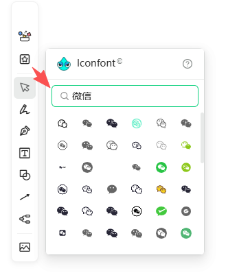

语雀文档中有一个画板工具，画板中有一个很好用的素材搜索功能，能够通过关键字快速搜索到相关的图标，然后选中自己喜欢的再拖动到画板中。

我跟进了浏览器的请求记录，以下是请求和返回数据的信息：

请求信息：
```bash
curl 'https://www.yuque.com/api/editor/iconfont?query=%E5%BE%AE&page_size=100&page=1' \
  -H 'Upgrade-Insecure-Requests: 1' \
  -H 'User-Agent: Mozilla/5.0 (Windows NT 10.0; Win64; x64) AppleWebKit/537.36 (KHTML, like Gecko) Chrome/145.0.0.0 Safari/537.36' \
  -H 'sec-ch-ua: "Not:A-Brand";v="99", "Google Chrome";v="145", "Chromium";v="145"' \
  -H 'sec-ch-ua-mobile: ?0' \
  -H 'sec-ch-ua-platform: "Windows"'
```

返回数据：
```json
{
    "data": {
        "icons": [
            {
                "id": 11372714,
                "name": "微博",
                "status": 1,
                "is_private": 0,
                "category_id": "1",
                "slug": "微博",
                "unicode": "59579",
                "width": 1024,
                "height": 1024,
                "defs": null,
                "path_attributes": "fill=\"#000000\"",
                "fills": 1,
                "font_class": "weibo",
                "user_id": 13662,
                "repositorie_id": 3406,
                "created_at": "2019-10-21T03:17:14.000Z",
                "updated_at": "2022-12-01T03:18:05.000Z",
                "preview_image": "t/icon_poster2_768/11372714/13662-Rf5CiadhlWpxbPtG5ElX9.png",
                "svg_hash": "3626d2cd47a4950c6a6daf132b9f5f72",
                "svg_fill_hash": "b99b15365699fdaaaa47792b04f8ecbe",
                "fork_from": null,
                "deleted_at": null,
                "show_svg": "<svg class=\"icon\" style=\"width: 1em;height: 1em;vertical-align: middle;fill: currentColor;overflow: hidden;\" viewBox=\"0 0 1024 1024\" version=\"1.1\" xmlns=\"http://www.w3.org/2000/svg\"><path d=\"M507.722667 393.525333c3.018667-0.202667 5.685333-0.618667 7.594666-1.141333 15.626667-12.458667 47.68-28.864 76.8-37.802667 48-14.72 90.24-12.16 118.421334 18.688 8.490667 9.301333 14.346667 19.562667 17.386666 30.698667 6.314667 23.04 2.453333 37.184-11.754666 69.248-10.506667 23.722667-11.146667 29.888-3.808 39.530667 4.896 6.410667 10.432 8.917333 22.293333 10.24 3.157333 0.362667 5.749333 0.554667 12.373333 0.96 57.472 3.605333 84.970667 26.922667 84.970667 98.538666 0 86.901333-60.821333 158.005333-160.138667 208.64C592.554667 871.530667 491.818667 896 415.072 896c-90.773333 0-175.872-18.026667-237.312-59.882667C93.546667 778.752 63.68 683.445333 101.514667 553.536c30.154667-103.541333 158.357333-246.88 279.114666-298.4 27.082667-11.562667 61.685333-13.962667 86.709334-1.706667 38.378667 18.773333 44.693333 61.184 20.128 111.946667-9.525333 19.68-8.576 22.368-0.426667 25.525333 5.514667 2.133333 13.226667 3.104 20.682667 2.624z m-77.866667-56.021333c6.293333-13.013333 8.597333-22.101333 8.341333-27.018667-6.613333-2.368-21.568-1.130667-32.458666 3.52C302.528 358.026667 187.733333 486.4 162.965333 571.424c-30.368 104.245333-9.557333 170.656 50.826667 211.786667C262.56 816.448 335.978667 832 415.072 832c66.592 0 157.365333-22.048 227.722667-57.898667C722.944 733.248 768 680.565333 768 622.485333c0-12.224-1.12-21.141333-2.986667-27.029333-1.002667-3.168-1.76-4.373333-2.24-4.768-1.226667-1.056-5.418667-1.962667-19.744-2.858667a283.594667 283.594667 0 0 1-15.498666-1.237333c-27.701333-3.093333-49.088-12.768-66.069334-35.061333-25.749333-33.781333-22.901333-61.141333-3.808-104.234667 7.904-17.856 9.397333-23.317333 8.544-26.432-0.277333-1.034667-1.056-2.4-2.912-4.426667-7.125333-7.797333-25.525333-8.917333-52.384-0.672-12.373333 3.797333-25.301333 9.258667-37.130666 15.445334-9.12 4.768-16.714667 9.578667-18.837334 11.445333-19.178667 16.821333-60.981333 19.541333-90.986666 7.936-44.064-17.056-59.456-60.672-34.08-113.088z m505.834667 85.610667a32 32 0 1 1-63.253334-9.706667C873.92 403.733333 874.666667 393.92 874.666667 384c0-106.037333-85.962667-192-192-192-2.794667 0-5.578667 0.064-8.352 0.181333a32 32 0 1 1-2.730667-63.946666c3.690667-0.16 7.381333-0.234667 11.082667-0.234667 141.386667 0 256 114.613333 256 256 0 13.173333-1.002667 26.24-2.976 39.114667z m-104.288-14.976a32 32 0 1 1-63.744-5.717334A85.333333 85.333333 0 0 0 682.666667 309.333333a32 32 0 0 1 0-64c82.474667 0 149.333333 66.858667 149.333333 149.333334 0 4.512-0.202667 9.013333-0.597333 13.472z\" fill=\"#000000\" /></svg>"
            },
            {
                "id": 11372717,
                "name": "微信",
                "status": 1,
                "is_private": 0,
                "category_id": "1",
                "slug": "微信",
                "unicode": "59579",
                "width": 1024,
                "height": 1024,
                "defs": null,
                "path_attributes": "fill=\"#000000\"",
                "fills": 1,
                "font_class": "weixin",
                "user_id": 13662,
                "repositorie_id": 3406,
                "created_at": "2019-10-21T03:17:14.000Z",
                "updated_at": "2022-12-01T03:18:05.000Z",
                "preview_image": "t/icon_poster2_768/11372717/13662-Ega5QEW_m2E5VtZlA4Aa6.png",
                "svg_hash": "76f8a368de360de1d29a5a1fb64014b0",
                "svg_fill_hash": "346debef720bb09336511aa6259179f4",
                "fork_from": null,
                "deleted_at": null,
                "show_svg": "<svg class=\"icon\" style=\"width: 1em;height: 1em;vertical-align: middle;fill: currentColor;overflow: hidden;\" viewBox=\"0 0 1024 1024\" version=\"1.1\" xmlns=\"http://www.w3.org/2000/svg\"><path d=\"M767.818667 409.173333C867.338667 444.266667 938.666667 539.136 938.666667 650.666667c0 42.709333-10.496 83.978667-30.261334 120.842666-1.792 3.338667-4.992 8.928-9.696 16.96l14.613334 53.557334c6.506667 23.893333-15.402667 45.813333-39.296 39.296l-53.642667-14.634667-6.229333 3.669333A254.933333 254.933333 0 0 1 682.666667 906.666667c-77.994667 0-147.84-34.88-194.805334-89.888a352.608 352.608 0 0 1-56.64 4.554666c-63.338667 0-124.266667-16.853333-177.472-48.298666-1.834667-1.088-6.410667-3.733333-13.632-7.893334l-80.544 21.653334c-23.914667 6.432-45.76-15.573333-39.146666-39.434667l21.792-78.752a961.205333 961.205333 0 0 1-15.904-27.317333A336.384 336.384 0 0 1 85.333333 480c0-188.618667 154.965333-341.333333 345.888-341.333333 159.914667 0 297.984 108.010667 335.818667 259.296 0.949333 3.765333 1.173333 7.552 0.778667 11.2z m-68.106667-13.952C662.88 282.037333 555.178667 202.666667 431.221333 202.666667 275.434667 202.666667 149.333333 326.933333 149.333333 480c0 46.272 11.498667 90.837333 33.194667 130.698667 2.88 5.290667 10.176 17.706667 21.621333 36.746666a32 32 0 0 1 3.413334 25.013334l-10.517334 37.994666 39.232-10.549333a32 32 0 0 1 24.234667 3.146667c14.272 8.192 22.773333 13.098667 25.802667 14.890666A283.882667 283.882667 0 0 0 431.221333 757.333333c6.154667 0 12.288-0.192 18.389334-0.576A255.061333 255.061333 0 0 1 426.666667 650.666667c0-141.386667 114.613333-256 256-256 5.728 0 11.413333 0.192 17.045333 0.554666z m133.706667 397.056a32 32 0 0 1 3.338666-24.725333 996.672 996.672 0 0 0 15.242667-26.293333A190.997333 190.997333 0 0 0 874.666667 650.666667c0-106.037333-85.962667-192-192-192s-192 85.962667-192 192 85.962667 192 192 192a190.933333 190.933333 0 0 0 98.570666-27.2c2.208-1.322667 8.288-4.874667 18.517334-10.837334a32 32 0 0 1 24.522666-3.210666l12.565334 3.424-3.424-12.565334zM330.666667 426.666667a42.666667 42.666667 0 1 1 0-85.333334 42.666667 42.666667 0 0 1 0 85.333334z m192 0a42.666667 42.666667 0 1 1 0-85.333334 42.666667 42.666667 0 0 1 0 85.333334z m85.333333 202.666666a32 32 0 1 1 0-64 32 32 0 0 1 0 64z m149.333333 0a32 32 0 1 1 0-64 32 32 0 0 1 0 64z\" fill=\"#000000\" /></svg>"
            },
            {
                "id": 77156,
                "name": "微信",
                "status": 1,
                "is_private": 0,
                "category_id": "1",
                "slug": "微信",
                "unicode": "983302",
                "width": 1024,
                "height": 1024,
                "defs": null,
                "path_attributes": "fill=\"#5D5D5D\"",
                "fills": 1,
                "font_class": "weixin",
                "user_id": 363,
                "repositorie_id": 60,
                "created_at": "2014-11-25T03:53:56.000Z",
                "updated_at": "2022-11-30T14:39:47.000Z",
                "preview_image": "t/icon_poster2_768/77156/363-HNzdO9Hahnvql-mA6POEJ.png",
                "svg_hash": "8b0f74cbf9edbd255cb41d114468259f",
                "svg_fill_hash": "64d7443f2a85e21e0383d92e61f88c0e",
                "fork_from": null,
                "deleted_at": null,
                "show_svg": "<svg class=\"icon\" style=\"width: 1em;height: 1em;vertical-align: middle;fill: currentColor;overflow: hidden;\" viewBox=\"0 0 1024 1024\" version=\"1.1\" xmlns=\"http://www.w3.org/2000/svg\"><path d=\"M664.250054 368.541681c10.015098 0 19.892049 0.732687 29.67281 1.795902-26.647917-122.810047-159.358451-214.077703-310.826188-214.077703-169.353083 0-308.085774 114.232694-308.085774 259.274068 0 83.708494 46.165436 152.460344 123.281791 205.78483l-30.80868 91.730191 107.688651-53.455469c38.558178 7.53665 69.459978 15.308661 107.924012 15.308661 9.66308 0 19.230993-0.470721 28.752858-1.225921-6.025227-20.36584-9.521864-41.723264-9.521864-63.862493C402.328693 476.632491 517.908058 368.541681 664.250054 368.541681zM498.62897 285.87389c23.200398 0 38.557154 15.120372 38.557154 38.061874 0 22.846334-15.356756 38.156018-38.557154 38.156018-23.107277 0-46.260603-15.309684-46.260603-38.156018C452.368366 300.994262 475.522716 285.87389 498.62897 285.87389zM283.016307 362.090758c-23.107277 0-46.402843-15.309684-46.402843-38.156018 0-22.941502 23.295566-38.061874 46.402843-38.061874 23.081695 0 38.46301 15.120372 38.46301 38.061874C321.479317 346.782098 306.098002 362.090758 283.016307 362.090758zM945.448458 606.151333c0-121.888048-123.258255-221.236753-261.683954-221.236753-146.57838 0-262.015505 99.348706-262.015505 221.236753 0 122.06508 115.437126 221.200938 262.015505 221.200938 30.66644 0 61.617359-7.609305 92.423993-15.262612l84.513836 45.786813-23.178909-76.17082C899.379213 735.776599 945.448458 674.90216 945.448458 606.151333zM598.803483 567.994292c-15.332197 0-30.807656-15.096836-30.807656-30.501688 0-15.190981 15.47546-30.477129 30.807656-30.477129 23.295566 0 38.558178 15.286148 38.558178 30.477129C637.361661 552.897456 622.099049 567.994292 598.803483 567.994292zM768.25071 567.994292c-15.213493 0-30.594809-15.096836-30.594809-30.501688 0-15.190981 15.381315-30.477129 30.594809-30.477129 23.107277 0 38.558178 15.286148 38.558178 30.477129C806.808888 552.897456 791.357987 567.994292 768.25071 567.994292z\" fill=\"#5D5D5D\" /></svg>"
            }
        ],
        "count": 1030
    }
}
```


现在我使用obsidian 中的excalidraw 作为画图工具，也挺好用的，但是没有像语雀这样的图标搜索功能，我习惯使用语雀的这个功能，这让我很难受，然后我发现obsidian excalidraw 是可以添加自定脚本来实现一些功能的，于是我想自定义一个类似的插件来实现我要需求。我找到了一个obsidian excalidraw 开源的插件厂库。你的任务是学习这个仓库，帮我自定义一个图标搜索功能，调用上面的接口。实现搜索，让我可以拖动搜素到的图标到excalidraw 画布中进行使用。


## 插件仓库地址
学习这个github厂库的代码：
https://github.com/zsviczian/obsidian-excalidraw-plugin

## 特殊说明
1. 调用上面语雀 https://www.yuque.com/api/editor/iconfont?query=%E5%BE%AE&page_size=100&page=1 接口，是需要登录语雀的。如果没有登录会返回`{"status":401,"message":"Unauthorized"}` 
所以使用插件前，需要验证是否登录，如果没有登录需要让用户登录，或者让用户在浏览器登录之后，拷贝浏览其中的cookie到插件中插件需要提供一个接受用户cookie的多行输入框，保存后需要缓存起来，一旦cookie失效循环这个操作；
2. 插件需要提供明确的安装文档和方法，与标准插件保持一致；
3. 插件安装后，用户可以obsidian excalidraw 工具栏中看到这个插件的icon，这个插件的icon你帮我生成一个符合场景的，如果不能生成就使用iconfont的官方icon。
4. 用户点击插件后会弹出一个和语雀一样的搜索面板悬浮在白板上面，或者调用obsidian中的命令弹出一个可以搜索的面板，用户输入关键字，调用上面的接口进行查询，查询出结果后，所有的图标都使用宫格的方式排列，每行显示多少个取决于弹窗面板的宽度，需要做自动适配，每一个图标的宽和高相等16px, 每个图标边距margin:8px。默认分页显示，每页显示100个，如果还有下一页，可以触发滚动条最底部事件，查询下一个append到面板中；
5. 鼠标移动到单个图标上，鼠标成手指形状，背景设置阴影效果，移除后恢复，鼠标左键点击，复制当前图标信息，关闭搜索面板（保留用户本次的搜索关键字，方便下次打开还自动带着在搜素框中），然后移动到白板后再点击的时候，被点击的这个图标就会被现实在画布上，插入到画布后32x32像素；这样完成了整个操作应用 步骤。

永远出现在鼠标点击位置
图标的大小应该随着用户画布缩放的百分比自动进行计算缩放比例

## 其他要求
1. 这个项目我需要开源到github，请遵循开源协议，让其他人看到我这项目也能够方便的下载和安装；
2. 开发完成后，有这代码有更新，你需要帮我提交代码到github，先创建私有仓库，名字就用当前工程的名称。